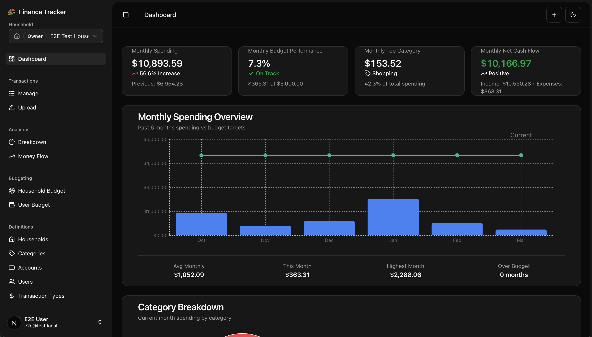
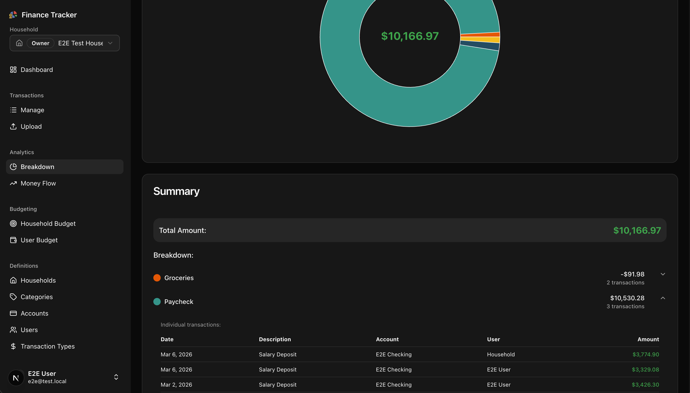
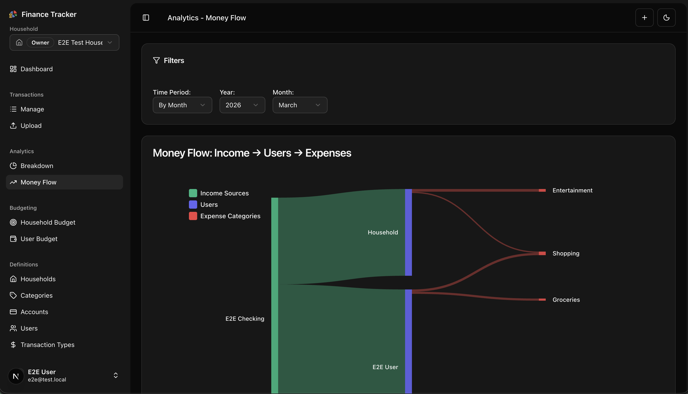
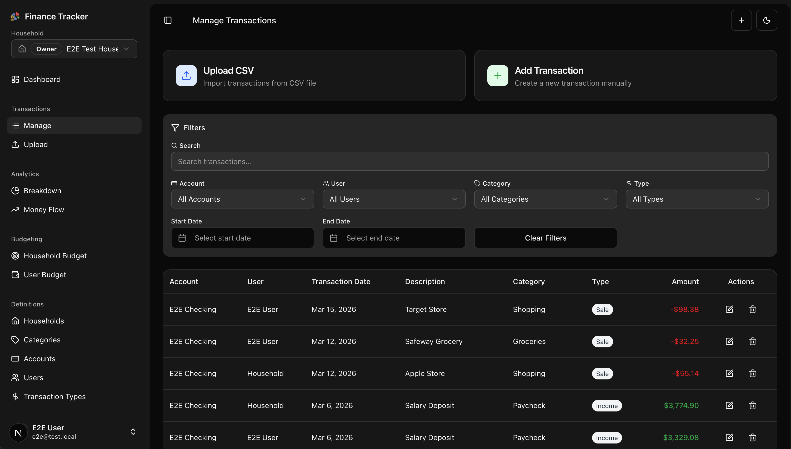
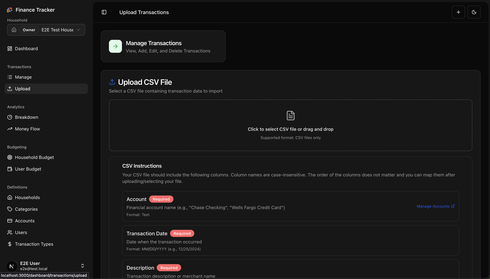
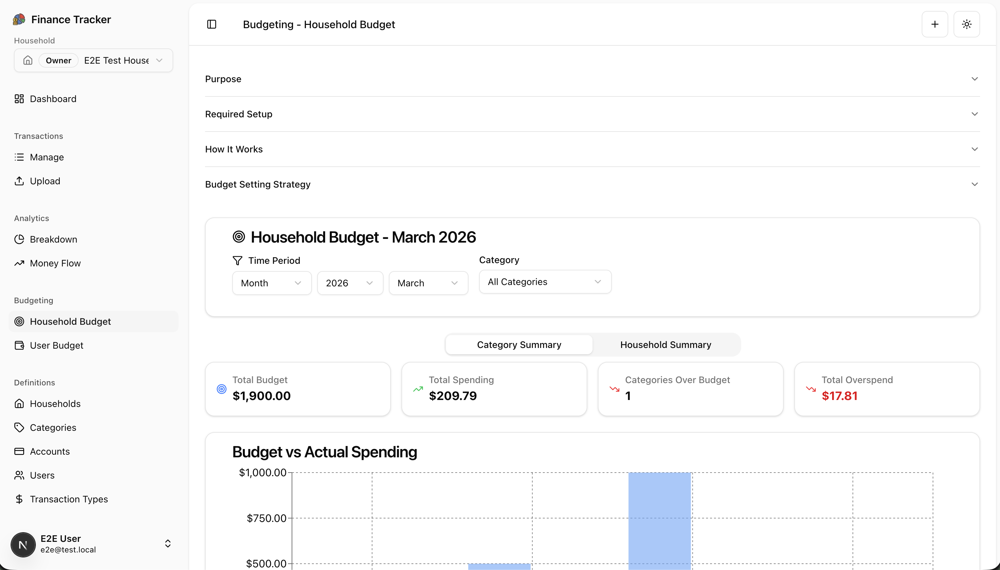
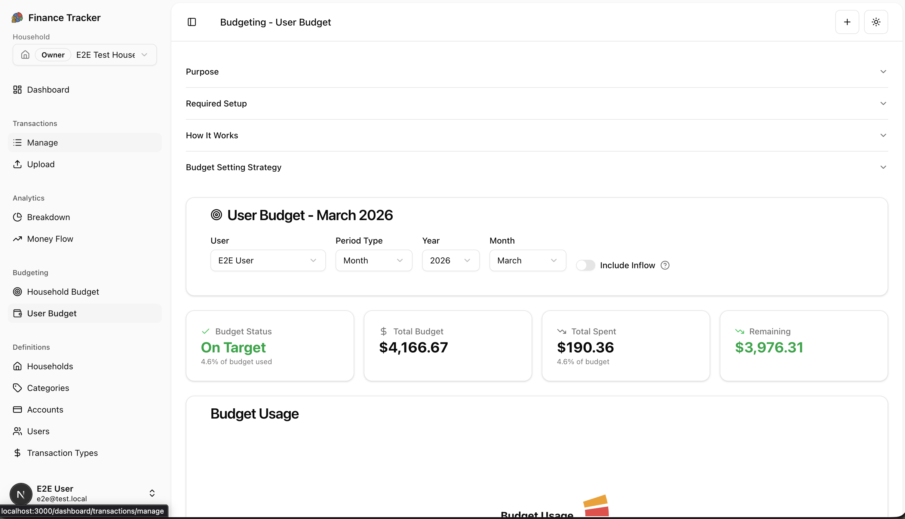

<h1 align="center">Finance Tracker</h1>

<p align="center">
  A self-hosted personal finance application for tracking transactions, analyzing spending, and managing household budgets. Own your financial data.
</p>

<p align="center">
  <a href="https://github.com/dfsf5263/finance-tracker/actions/workflows/ci.yml"></a>
  <a href="https://github.com/dfsf5263/finance-tracker/blob/main/LICENSE"></a>
  <a href="https://github.com/dfsf5263/finance-tracker/pkgs/container/finance-tracker"></a>
</p>

<p align="center">
  
  
  
  
  
  
  
  
  
  
  
</p>

<p align="center">
  <picture>
    
  </picture>
</p>

<details>
<summary><strong>📸 Screenshots</strong></summary>

<br />

<table>
  <tr>
    <td align="center"><strong>Analytics Breakdown</strong></td>
    <td align="center"><strong>Money Flow</strong></td>
  </tr>
  <tr>
    <td></td>
    <td></td>
  </tr>
  <tr>
    <td align="center"><strong>Transaction Management</strong></td>
    <td align="center"><strong>CSV Upload</strong></td>
  </tr>
  <tr>
    <td></td>
    <td></td>
  </tr>
  <tr>
    <td align="center"><strong>Household Budget</strong></td>
    <td align="center"><strong>User Budget</strong></td>
  </tr>
  <tr>
    <td></td>
    <td></td>
  </tr>
</table>

</details>

## Why Self-Host?

Your financial data is some of the most sensitive information you have. Finance Tracker is designed to run on your own hardware — a home server, a VPS, or anywhere you choose — so your transaction history, budgets, and spending patterns never leave your control. No third-party accounts, no data harvesting, no subscriptions. Just a Docker image you can deploy in minutes.

> **See also:** [Health Tracker](https://github.com/dfsf5263/health-tracker) — a companion self-hosted app for tracking health data with the same privacy-first approach.

## Features

- 🏠 **Multi-Household Support** — Manage multiple households with role-based member access and invitations
- 💰 **Transaction Management** — Track income, expenses, and transfers with detailed categorization
- 📊 **Analytics & Reporting** — Visual category breakdowns, Sankey money-flow diagrams, and spending insights
- 💸 **Budget Management** — Set and track budgets per household and per user with overage alerts
- 📈 **CSV Import/Export** — Bulk transaction upload with intelligent duplicate detection and deduplication tools
- 🔐 **Authentication & Security** — Email/password auth with 2FA, email verification, rate limiting, and input validation
- 🎯 **Smart Definitions** — Customizable accounts, categories, transaction types, and users
- 📱 **Responsive UI** — Clean dashboard with dark/light theme support built on shadcn/ui
- 📧 **Email Notifications** — Weekly spending summaries and transactional emails via Resend

## Tech Stack

**Frontend** — Next.js 15 (App Router), React 19, TypeScript, Tailwind CSS v4, shadcn/ui, Recharts, D3

**Backend** — Next.js API Routes, Prisma ORM 7, PostgreSQL 17, Zod validation

**Auth** — Better Auth (email/password, 2FA, email verification, sessions)

**Email** — Resend for transactional emails and weekly summaries

**Testing** — Vitest + React Testing Library (unit), Playwright (E2E)

**DevOps** — GitHub Actions CI/CD, Docker (GHCR), Biome (formatter/linter)

## Getting Started

### Prerequisites

- **Node.js** 24+ and npm
- **PostgreSQL** 12+ (or use Docker)

### Quick Start with Docker Compose

The fastest way to run Finance Tracker. Includes PostgreSQL — no external database needed.

```bash
cp .env.docker .env
# Edit .env with your secrets and email config

docker compose up -d
```

Open [http://localhost:3000](http://localhost:3000) to use the app. Database migrations run automatically on first startup.

> **📖 Full deployment guide:** [Docker Deployment Guide](docs/DOCKER_DEPLOYMENT.md)

### Local Development

1. **Clone and install:**

   ```bash
   git clone https://github.com/dfsf5263/finance-tracker.git
   cd finance-tracker
   npm install
   ```

2. **Configure environment:**

   ```bash
   cp .env.example .env.local
   # Edit .env.local with your database URL and secrets
   ```

3. **Set up the database:**

   ```bash
   npx prisma migrate dev
   npx prisma db seed
   ```

4. **Start the dev server:**

   ```bash
   npm run dev
   ```

   Open [http://localhost:3000](http://localhost:3000).

## Environment Variables

| Variable | Required | Description |
|---|---|---|
| `DATABASE_URL` | ✅ | PostgreSQL connection string |
| `BETTER_AUTH_SECRET` | ✅ | Session signing secret (32+ characters) |
| `APP_URL` | ✅ | Application URL for auth callbacks and emails |
| `RESEND_API_KEY` | ✅ | [Resend](https://resend.com) API key for transactional emails |
| `RESEND_FROM_EMAIL` | ✅ | Sender email address (use `onboarding@resend.dev` for development) |
| `RESEND_REPLY_TO_EMAIL` | | Reply-to email for support |
| `SKIP_MIGRATIONS` | | Set to `true` to skip auto-migration on Docker startup |
| `ENABLE_SEEDING` | | Set to `true` to seed default data on Docker startup |

See [.env.example](.env.example) for a complete template.

## Testing

Finance Tracker has a comprehensive 3-tier testing strategy:

### Unit Tests

```bash
npm run test              # Run unit tests
npm run test:watch        # Watch mode
npm run test:coverage     # Run with coverage report
```

Powered by [Vitest](https://vitest.dev/) with [React Testing Library](https://testing-library.com/react) and [vitest-mock-extended](https://github.com/eratio08/vitest-mock-extended).

### End-to-End Tests

```bash
# Start the E2E database
npm run db:e2e:up

# Reset and seed the E2E database
npm run db:e2e:reset

# Run E2E tests
npm run test:e2e

# Run with browser UI
npm run test:e2e:ui

# Shut down the E2E database
npm run db:e2e:down
```

Powered by [Playwright](https://playwright.dev/) running Chromium against a real PostgreSQL database.

## CI/CD Pipeline

The project uses GitHub Actions with two workflows:

**CI** (`ci.yml`) — Runs on every push and pull request to `main`:

1. **Lint, Format & Typecheck** — `npm run check` (Biome + TypeScript)
2. **Unit Tests** — `npm run test` (runs in parallel with step 1)
3. **E2E Tests** — Playwright against a PostgreSQL service container (runs after steps 1 & 2 pass)

**Release** (`release.yml`) — Runs on push to `main` and version tags (`v*`):

- Builds multi-arch Docker images (amd64 + arm64) and pushes to [GitHub Container Registry](https://github.com/dfsf5263/finance-tracker/pkgs/container/finance-tracker)
- Tags: `latest`, `<version>` (from `package.json`), `sha-<commit>`, `main`
- Version tags are **immutable** — the build fails if the version already exists in GHCR

## Project Structure

```
src/
├── app/
│   ├── (auth)/              # Auth pages (sign-in, sign-up, forgot-password, 2FA)
│   ├── api/                 # API routes (transactions, budgets, analytics, auth)
│   └── dashboard/
│       ├── analytics/       # Breakdown charts, Sankey money-flow
│       ├── transactions/    # Manage & CSV upload
│       ├── budgeting/       # Household & user budgets
│       ├── definitions/     # Accounts, categories, types, users, households
│       ├── settings/        # Profile, security, household, email subscriptions
│       └── utility/         # Duplicate detection & deduplication
├── components/              # Reusable React components + shadcn/ui
├── contexts/                # React contexts (household multi-tenancy)
├── hooks/                   # Custom hooks (CRUD, active month, entity counts)
├── lib/                     # Business logic, validation, auth, analytics, email
└── types/                   # TypeScript type definitions
prisma/
├── schema.prisma            # Database schema
├── seed.ts                  # Database seeding script
└── migrations/              # Prisma migrations
tests/
└── e2e/                     # Playwright E2E test specs
```

## Deployment

### Docker (Self-Hosted)

Multi-arch images (amd64 + arm64) are published to GitHub Container Registry:

```bash
docker pull ghcr.io/dfsf5263/finance-tracker:latest
```

The container automatically runs database migrations on startup (skip with `SKIP_MIGRATIONS=true`).

See the [Docker Deployment Guide](docs/DOCKER_DEPLOYMENT.md) for Docker Compose quick deploy, reverse proxy setup, monitoring, backups, and troubleshooting.

## Development Commands

```bash
npm run dev              # Start dev server (Turbopack)
npm run build            # Production build
npm run check            # Lint + format check + typecheck
npm run format           # Format with Biome
npm run test             # Unit tests
npm run test:e2e         # E2E tests
npx prisma studio        # Database GUI
npx prisma migrate dev   # Create a new migration
```

## Contributing

1. Fork the repository
2. Create a feature branch (`git checkout -b feature/amazing-feature`)
3. Make your changes
4. Run checks: `npm run format && npm run check`
5. Commit and push
6. Open a Pull Request

## License

This project is licensed under the MIT License — see the [LICENSE](LICENSE) file for details.
